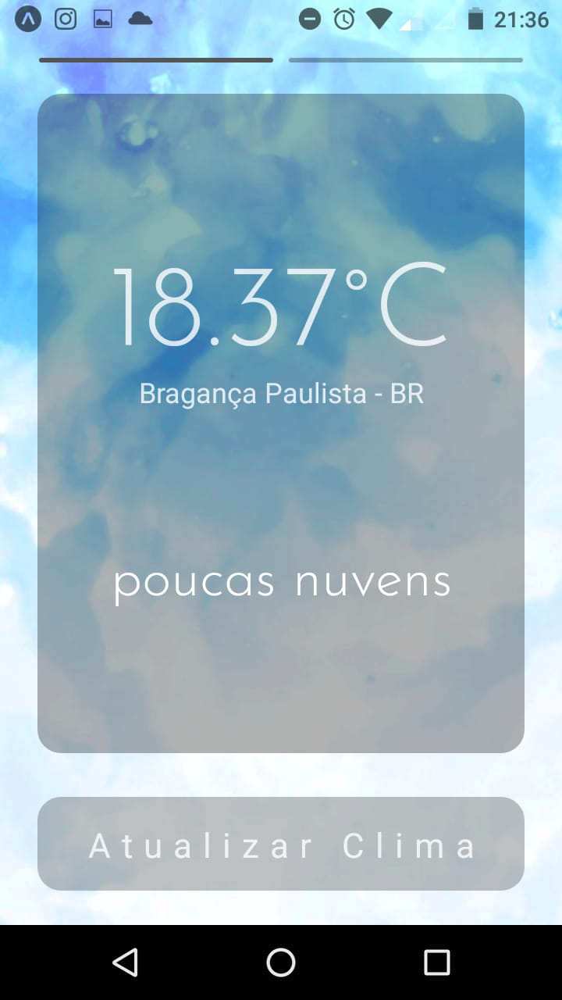
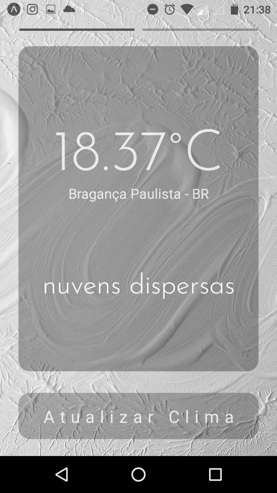
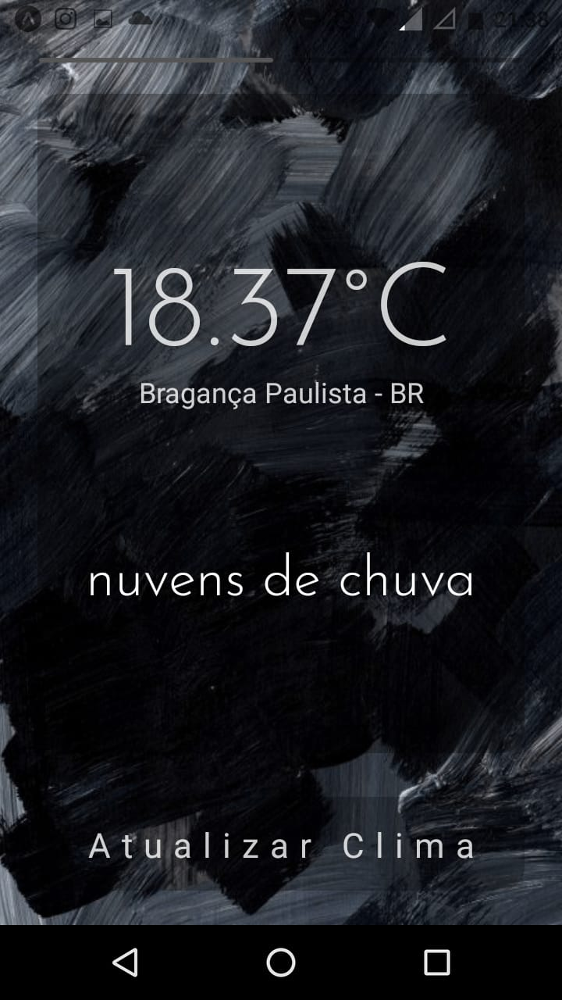
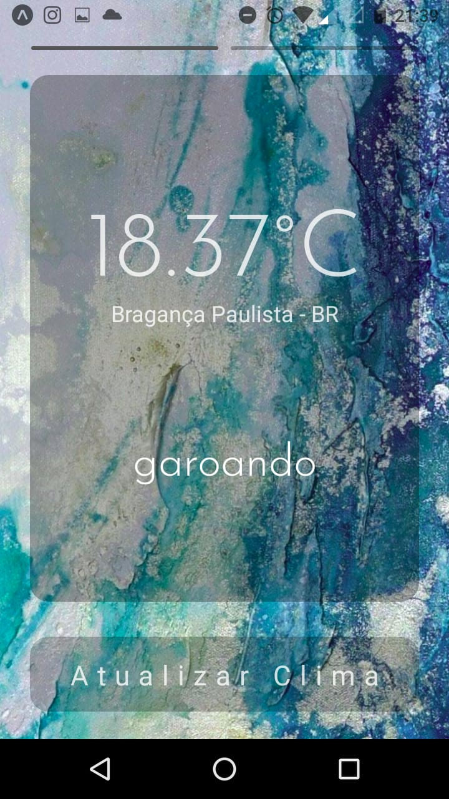
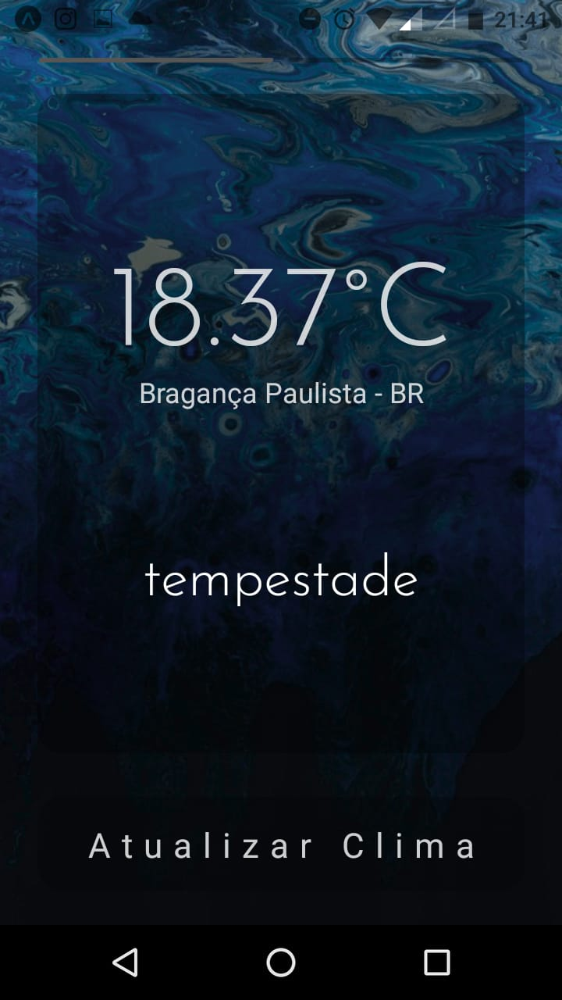
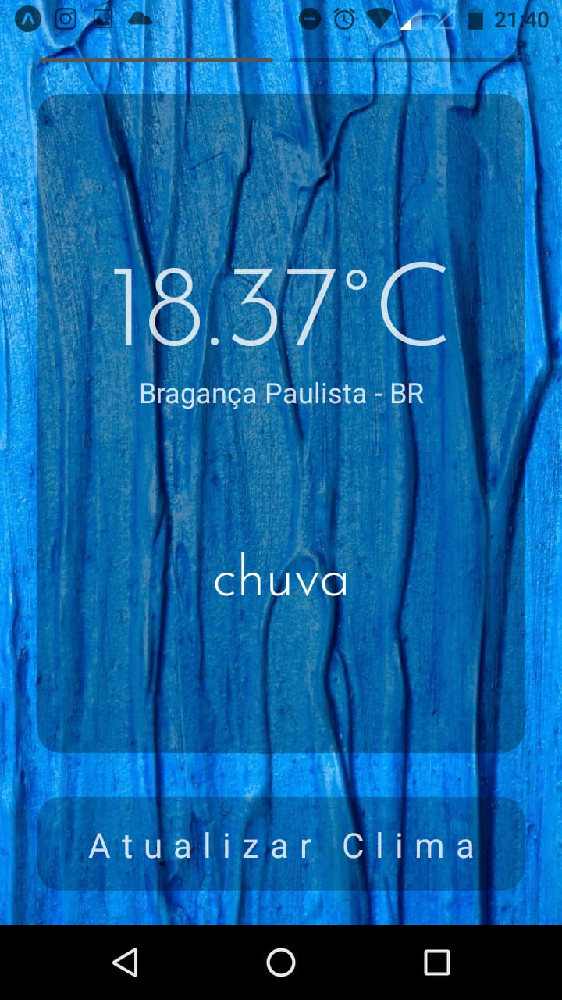
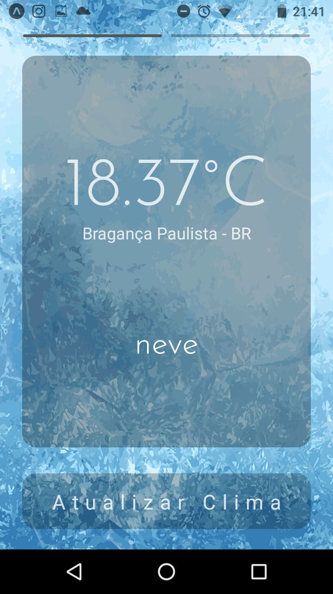
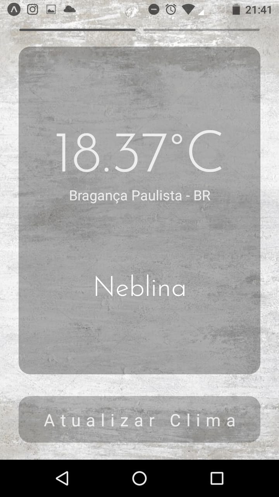
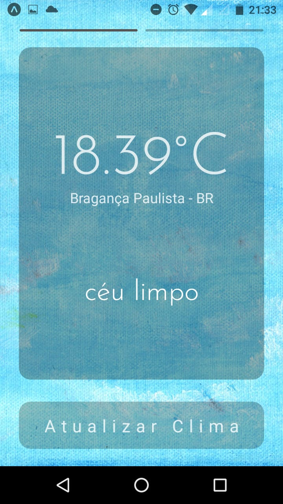

<h1 align="center">
    
</h1>

<h4 align="center"> 
	🚧 weather Now 1.0 - sempre em construção... 🚧
</h4>

<p align="center">
  

  
  
  <a href="https://github.com/AngeloLanch/weatherNow/commits/master">
    
  </a>

  
</p>


## 💻 Sobre o projeto

Weather Now - para quem gosta de acompanhar a temperatura que está fazendo no local onde se está, ou por pura curiosidade quer obter dados detalhados do clima.

Os usuários terão acesso ao aplicativo móvel, onde poderão:
- verificar a temperatura que está fazendo Agora na Exata localização em que está sendo feita a consulta.
- Obter dados detalhados sobre o clima como a temperatura máxima, mínima, humidade relatiav do ar, velocidade do vento, visibilidade, e mais.

Projeto inicialmente desenvolvido para pletear o cargo de desenvolvedor junior em React Native, mas que já ganhou o meu coração e um espaço no meu portifolio.

## 🎨 Layout

O layout da aplicação foi pensado a relacionar as condições climátias com a aparência do app, alterando a imagem de background de acordo com a descrição climática do momento.
Como um amante da Arte no geral, escolhi as imagens a dedo, todas apresentando uma testura de pincel e tinta sobre tela.

### Mobile Screens

<p align="center">
  
  
  
  
  
  
  
  
  
  
  
</p>

## 🛠 Tecnologias

As seguintes ferramentas foram usadas na construção do projeto:
- [Expo][expo]
- [React Native][rn]
- [TypeScript][typescript]

## :mailbox_closed: API

A API utilizada para fornecer os dados climáticos foi a OpenWeather, em sua versão gratuíta:
Para mais detalhes acesse: https://openweathermap.org/

## :calling: Como executar o projeto

Este é um projeto inteiramente front-end!
A chamada para a utilização da API fica na pasta services no arquivo weatherAPI

### Pré-requisitos

Antes de começar, você vai precisar ter instalado em sua máquina as seguintes ferramentas:
[Git](https://git-scm.com), 
[Node.js][nodejs],
[Expo](https://git-scm.com)

Além disto é bom ter um editor para trabalhar com o código como [VSCode][vscode]

### :cat: Clonando o Repositório

```bash
# Clone este repositório
$ git clone https://github.com/AngeloLanch/weatherNow
            
# Acesse a pasta do projeto no terminal/cmd
$ cd weatherNow

# Instale as dependências
$ yarn install

### :repeat: Rodando a aplicação

```
# Execute a aplicação
$ yarn start (um escrip que executará o comando expo start)

## :raising_hand: Para contribuir com o projeto

1. Faça um **fork** do projeto.
2. Crie uma nova branch com as suas alterações: `git checkout -b my-feature`
3. Salve as alterações e crie uma mensagem de commit contando o que você fez: `git commit -m "feature: My new feature"`
4. Envie as suas alterações: `git push origin my-feature`
> Caso tenha alguma dúvida confira este [guia de como contribuir no GitHub](https://github.com/firstcontributions/first-contributions)

## 📝 Licença

Feito por: Ângelo Lanche
Este projeto esta sobe a licença MIT.

Este projeto foi um novo desafio ao qual me propus e também marca uma nova etapa para mim como desenolvedor júnior 
[Entre em contato!](https://www.linkedin.com/in/AngeloLanch/)

[nodejs]: https://nodejs.org/
[typescript]: https://www.typescriptlang.org/
[expo]: https://expo.io/
[rn]: https://facebook.github.io/react-native/
[yarn]: https://yarnpkg.com/
[vscode]: https://code.visualstudio.com/
[vceditconfig]: https://marketplace.visualstudio.com/items?itemName=EditorConfig.EditorConfig
[license]: https://opensource.org/licenses/MIT

O format deste Readme foi inspirado em: https://github.com/tgmarinho/Ecoleta/blob/master/README.md
